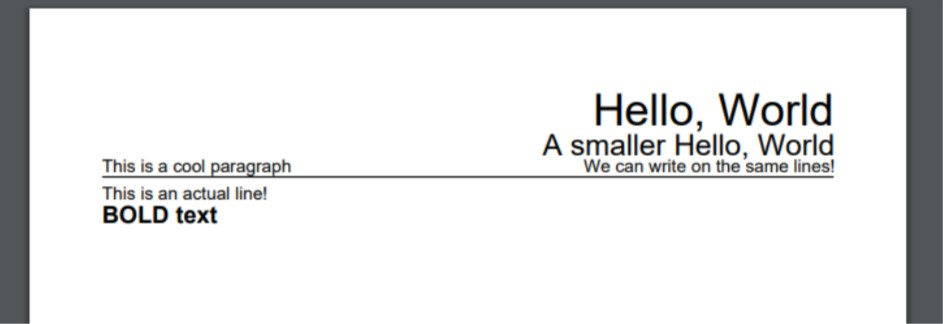

# A simple typesetter to format documents

It uses the PDFGen library to output to pdf

## How to use

To use BMO run
`BMO <name of source>`

This will take your BMO source code and output a pdf in the same directory named `output.pdf`

A simple example program is shown below
```
.title.30.right
"Hello, World"
.title.20.right
"A smaller Hello, World"
.para.ghost.12.left
"This is a cool paragraph"
.para.12.right
"We can write on the same lines!"
.line
"This is an actual line!"
.para.bold.16.left
"BOLD text"
```

The output for the above is:


